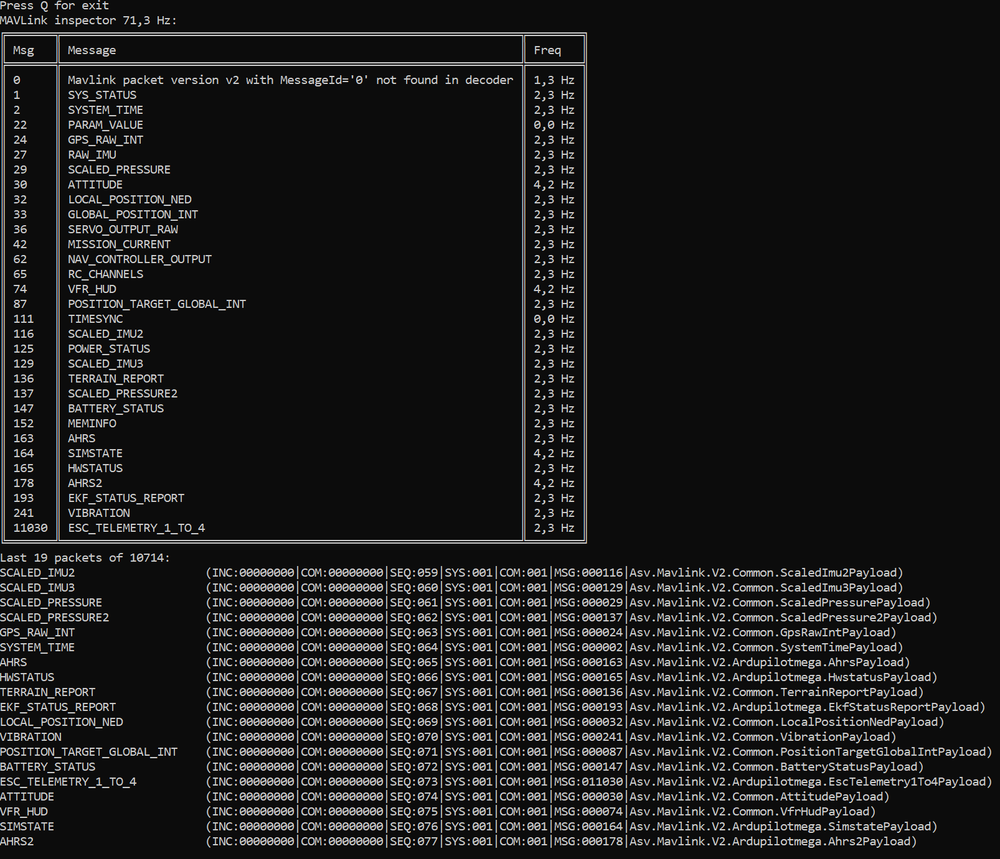

# asv-mavlink

Mavlink library for .NET Framework 4.6.1, .NET5.0, .NET 6.0, Mono (support MAVLinkV2 packets)

You can control vehicles, that support [MAVLink](https://mavlink.io/en/) protocol.


# Code gen

Generate C# code for packet serialization\deserialization
```bash
Asv.Mavlink.Shell.exe gen -t=all.xml -i=messages -o=src/Asv.Mavlink/Connection/Dialects -e=cs src/Asv.Mavlink.Shell/Resources/csharp.tpl
```
You can create your own code generator for any language by writing template file (.tpl) with [liquid](https://shopify.github.io/liquid/) syntax

# Example console application

Example packet statistic:
```sh
Asv.Mavlink.Shell.exe mavlink --cs=tcp://127.0.0.1:5760
```



## Versioning

Project is maintained under [the Semantic Versioning guidelines](http://semver.org/).
